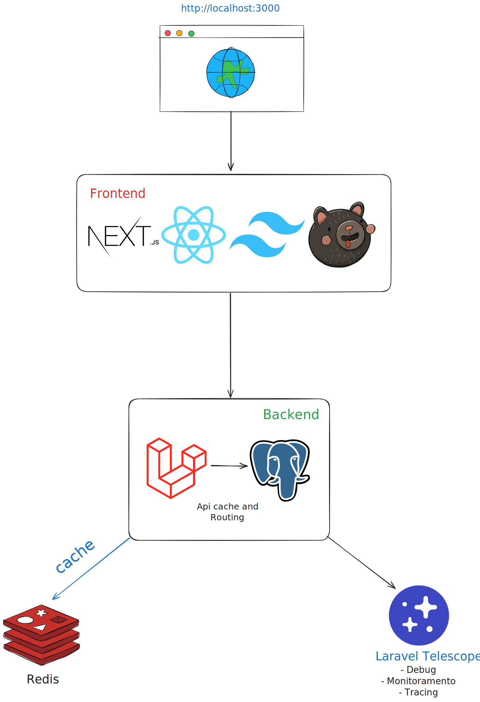

# Real-time Chat Application

Sistema de chat em tempo real com Laravel + Next.js + PostgreSQL + Laravel Reverb.



## Requisitos

- PHP 8.3+
- Composer
- Node.js 18+
- npm ou yarn
- PostgreSQL 16+ (ou SQLite para desenvolvimento)
- Redis
- Docker

---

## Rodando com Docker

### 1. Backend

```bash
cd backend

docker-compose up -d

docker-compose exec backend bash

php artisan migrate

php artisan db:seed
```

O backend estará disponível em http://localhost:8000.

### 2. Frontend
```bash
cd frontend

npm install

npm run dev
```

Frontend disponível em http://localhost:3000.

#### Features Implementadas
✅ Autenticação  
✅ Chat      
✅ Histórico de mensagens com paginação  
✅ Busca de usuários    
✅ Logging  
✅ Testes automatizados  
✅ Documentação Swagger  


## 3. Documentação da API
Após iniciar o backend, acesse:  
Swagger UI: http://localhost:8000/api/documentation  
Telescope: http://localhost:8000/telescope  